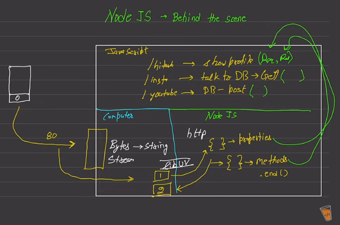

## Intro
- In 2009, *Ryan Dahl* introduced Node.exe (similar to Chrome) with v8 inside
   - In node, we don't have document/window object, instead we have: `fs, http`
   - node = v8 + some additional modules that are missing in browser
- Node is not a programming language or framework either, it's a **runtime environment** for executing JS code.
- NodeJS engine: call stack, Node APIs, event loop, callback queue
- JS doesn't have the power to access stuffs like Networking or other, but Node has (using C/C++ internally, aka **`libuv`**), Node has **Node API**
- Library like **Express** makes it easier to works with response writing (as a stream) with JSON

## Behind the scene (mental model)

- Regarding http and libuv, client to server
- libuv interacts with NIC of the computer



## How Node.js works
- highly-scalable, data-intensive and real-time apps, node is ideal for I/O-intensive apps
- **non-blocking asynchronous** nature
- Don't use Node for CPU-intensive apps, for example: video encoding, img manipulation service

## Modules
- Every node application has at least one module or file called `main`
- node has `module` object and it's not a part of `global` object

### Module Wrapper Function
- Node wraps each file/module in a wrapper function at runtime
```js
(function (exports, require, module, __filename, __dirname) {
   ///
})()
```

## Builtin-Modules in Node.js
### Path Module
```js
var pathObj = path.parse(__filename);
```

### OS Module
- `os.totalmem()`
- `os.freemem()`

### Events
- Event = A signal that something has happened
- Event is one of the core parts of Node

#### EventEmitter (class)

**Bunch of node core functionalities are based/built on EventEmitter**

```js
const EventEmitter = require('events');  // Here all uppercase starting means it's a convention that it represents a class

emitter = new EventEmitter();

// Register a listener
emitter.on('messageLogged', function() {
   console.log('Listener called');
});

// Raise an event
emitter.emit('messageLogged');
```

#### Event Arguments
```js
emitter.on('messageLogged', (arg) => {
   console.log('Listener called', arg);
});

emitter.emit('messageLogged', { id: 1, url: 'http://' });
```

### HTTP

Networking stuffs.

```js
const http = require('http');

const server = http.createServer();  // it's an EventEmitter!

server.on('connection', (socket) {
   console.log('New connection...');
});

server.listen(3000);

console.log('Listening on port 3000...');
```

Actually, we should write the above like this:

```js
const server = http.createServer((req, res) => {
   if (req.url === '/') {
      res.write('Hello World');
      res.end();
   }

   if (req.url === '/api/courses') {
      res.write(JSON.stringify([1, 2, 3]));
      res.end();
   }
});

server.listen(3000);
```

In real application we don't write those using http, callback (req, res). Because it becomes complex when we add more routes. Instead we can use frameworks like **Express**.

## JS Module System

- Files ending with `.mjs` are always treated as ES Modules (ESM) by Node.js.
- `.js` files can be either CJS or ESM, depending on the project setting.

### CommonJS (CJS)
- Used by default in Node.js before ES modules.
- Synchronous, file-based module system.
- `module.exports`, `require()`

#### Characteristics

- Synchronous loading (**good for backend, bad for browser**)
- **Loaded at runtime**
- Default in Node.js files ending with .cjs or without `"type": "module"` in package.json

#### Where used

- Almost all Node.js libraries before 2020
- Express, lodash, old versions of React scripts, etc.

### ES Modules (ESM)
- Modern JavaScript module system (ECMAScript 2015).
- Native in browsers & now in Node.js.
- `export`, `import`

#### Characteristics

- **Asynchronous loading**
- Static structure → better tree-shaking & optimization
- Mandatory file extensions in Node.js (.js, .mjs)
- Enabled when:
   - filename is .mjs
   - OR `"type": "module"` in package.json

#### Where used

- Modern browser apps
- Node.js 14+ with `"type": "module"`

### UMD (Universal Module Definition)

- A module format that works everywhere: Node.js, AMD, browser globals.
- Used for older libraries published on CDN or npm.
- If you publish a library for all environments (or even better, publish dual: ESM + CJS)

#### Where used

- jQuery, Moment.js (old versions)
- Libraries intended to work both in **Node + browser**.

### Node.js Module Resolution Rules
If using CommonJS:

`require('./file')` → resolves to:
   - file.js
   - file.json
   - file.node (native addon)
   - index.js inside folder

If using ESM:
- import "./file" needs extension
- **file.js must be written explicitly**
- No auto-extension guessing